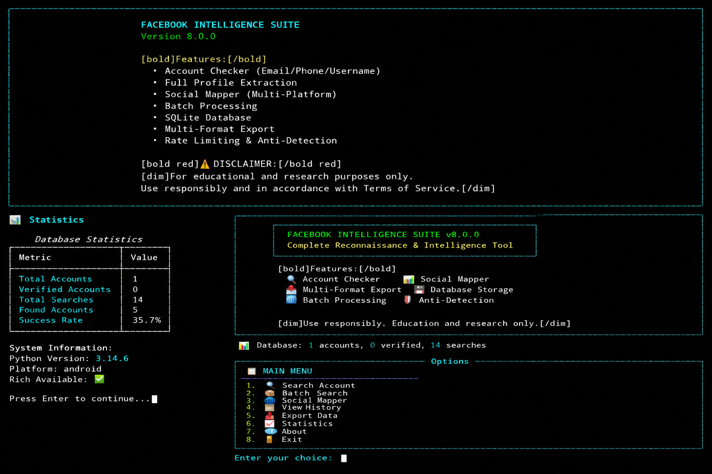

# METAØNEX - Facebook Intelligence Suite
# This TOOL is unfortunately not for noobies 
<p align="center">
  
</p> 
---

📌 Overview

METAØNEX is a comprehensive Facebook Intelligence Suite designed for security research, penetration testing, and educational purposes. It provides advanced reconnaissance capabilities for understanding privacy risks and security vulnerabilities in social media platforms.

🎯 Purpose

· Educational Research: Understanding OSINT techniques
· Security Testing: Identifying vulnerabilities
· Privacy Awareness: Demonstrating data exposure risks
· Bug Bounty Hunting: Responsible vulnerability discovery

⚠️ Disclaimer

IMPORTANT: This tool is for EDUCATIONAL AND RESEARCH PURPOSES ONLY. Use only on accounts you own or have explicit written permission to test. Unauthorized access is illegal and violates Facebook's Terms of Service. The author is not responsible for any misuse.

---

✨ Features

🔍 Core Capabilities

Feature Description Status
Account Checker Check existence by email, phone, or username ✅
Profile Extraction Full profile data extraction ✅
Social Mapper Multi-platform account discovery ✅
Batch Processing Threaded parallel search ✅
Database Storage SQLite with search history ✅
Multi-Format Export JSON, CSV, HTML ✅

🛡️ Advanced Features

Feature Description Status
Proxy Rotation Automatic proxy management ✅
Rate Limiting Anti-detection protection ✅
User Agent Rotation Random browser fingerprints ✅
Beautiful TUI Rich-based interface ✅
Fallback CLI Works without Rich ✅
Comprehensive Logging Debug and error tracking ✅

---

📊 Data Extraction Capabilities

Personal Information

```yaml
Identity:
  - Full Name
  - User ID
  - Username
  - Profile URL
  
Contact:
  - Email Address
  - Phone Number
  - Address
  
Profile:
  - Gender
  - Birthday
  - Bio
  - Verification Status
  
Media:
  - Profile Picture
  - Cover Photo
  
History:
  - Work Experience
  - Education History
  - Friends Count
  - Followers Count
  - Posts Count
```

---

🚀 Installation

Prerequisites

```bash
# Required
Python 3.7+
pip (Python package manager)

# Optional but Recommended
Git
Virtual Environment
```

Quick Install

```bash
# Clone the repository
git clone https://github.com/sylhetyhackvenger/METAONEX
cd METAONEX

# Install dependencies
pip install -r requirements.txt

# Run the tool
python3 facebook.py
```

Requirements File

```txt
requests>=2.31.0
beautifulsoup4>=4.12.0
rich>=13.0.0
lxml>=4.9.0
html5lib>=1.1
pytz>=2023.0
python-dateutil>=2.8.0
```

---

📖 Usage Guide

Basic Usage

```bash
# Interactive TUI Mode (Recommended)
python3 facebook.py

# Fallback CLI Mode (No Rich)
python3 facebook.py --no-rich
```

Menu Options

```
📋 MAIN MENU
────────────────────────────────────────
1. 🔍 Search Account
2. 📦 Batch Search
3. 🌐 Social Mapper
4. 📜 View History
5. 📤 Export Data
6. 📈 Statistics
7. ⚙️ Settings
8. ℹ️ About
9. 🚪 Exit
```

Search Examples

1. Search by Email

```bash
> Enter query: john.doe@gmail.com
✅ Account found!
Name: John Doe
User ID: 1000123456789
Profile: https://facebook.com/john.doe
Email: john.doe@gmail.com
Phone: +1-234-567-8900
Work: Google Inc. - Software Engineer
```

2. Search by Phone

```bash
> Enter query: +1-234-567-8900
✅ Account found!
Name: Jane Smith
User ID: 1000987654321
Profile: https://facebook.com/jane.smith
```

3. Search by Username

```bash
> Enter query: john.doe
✅ Account found!
Name: John Doe
User ID: 1000123456789
Profile: https://facebook.com/john.doe
```

Batch Search

```bash
📦 Batch Search
────────────────────────────────────────
Enter queries (one per line). Press Enter twice to finish.

> john.doe@gmail.com
> +1-234-567-8900
> jane.smith
> [ENTER]
> [ENTER]

Searching 3 accounts...
Processing... ━━━━━━━━━━━━━━━━━━━━━━━━━━━ 100%

Results:
  Found: 3
  Not found: 0

Found accounts:
  • john.doe@gmail.com -> John Doe
  • +1-234-567-8900 -> Jane Smith
  • jane.smith -> Jane Smith
```

Social Mapper

```bash
🌐 Social Mapper
────────────────────────────────────────
Enter names to search (format: First Last)
Example: John Doe

> John Doe
> Jane Smith
> Bob Johnson
> [ENTER]

Mapping... ━━━━━━━━━━━━━━━━━━━━━━━━━━━ 100%

Results:
  ✅ John Doe -> John Doe (https://facebook.com/john.doe)
  ✅ Jane Smith -> Jane Smith (https://facebook.com/jane.smith)
  ✅ Bob Johnson -> Bob Johnson (https://facebook.com/bob.johnson)
```

---

📁 Directory Structure

```
METAONEX/
├── metaohex.py                 # Main application
├── requirements.txt            # Dependencies
├── README.md                   # Documentation
├── LICENSE                     # MIT License
├── exports/                    # Exported data
│   ├── *.json
│   ├── *.csv
│   └── *.html
├── social_mapper_results/      # Social mapper results
│   ├── *.json
│   ├── *.csv
│   └── *.html
└── metaohex.db                 # SQLite database
```

---

🔧 Advanced Configuration

Proxy Support

```python
# Enable proxy rotation
settings > Toggle Proxy Usage

# Proxies are automatically loaded from:
- https://raw.githubusercontent.com/TheSpeedX/PROXY-List/master/http.txt
- https://raw.githubusercontent.com/ShiftyTR/Proxy-List/master/http.txt
- https://raw.githubusercontent.com/mertguvencli/http-proxy-list/main/proxy-list/data.txt
```

Rate Limiting

```python
# Default settings
max_requests_per_minute: 20
request_delay_min: 0.5
request_delay_max: 2.0
timeout: 30
max_retries: 3
```

User Agents

```python
# Random rotation from 8+ modern browsers
USER_AGENTS = [
    'Chrome 120',
    'Chrome 119',
    'Firefox 115',
    'Firefox 118',
    'Safari 17',
    'Edge 120',
    # ... and more
]
```

---

📊 Export Formats

JSON

```json
{
  "user_id": "1000123456789",
  "username": "john.doe",
  "name": "John Doe",
  "email": "john.doe@gmail.com",
  "phone": "+1-234-567-8900",
  "gender": "Male",
  "birthday": "1990-01-15",
  "profile_url": "https://facebook.com/john.doe",
  "is_verified": false,
  "status": "found",
  "confidence_score": 0.9
}
```

CSV

```csv
User ID,Username,Name,Email,Phone,Gender,Birthday,Profile URL,Verified,Status,Timestamp
1000123456789,john.doe,John Doe,john.doe@gmail.com,+1-234-567-8900,Male,1990-01-15,https://facebook.com/john.doe,False,found,2024-01-15T10:30:00
```

HTML

· Beautiful visual report
· Responsive design
· Clickable profile links
· Profile picture display
· Work/education history
· Statistics summary

---

🛡️ Security Features

Built-in Protections

· ✅ Rate limiting to prevent abuse
· ✅ User agent rotation for anonymity
· ✅ Proxy support for IP masking
· ✅ Request retry with backoff
· ✅ Error handling and recovery
· ✅ Session management
· ✅ Cookie handling

Best Practices

```python
# Always enable rate limiting
config.max_requests_per_minute = 20

# Use proxies for anonymity
config.use_proxy = True

# Rotate user agents
fingerprint.rotate()

# Add random delays
time.sleep(random.uniform(0.5, 2.0))
```
<p align="center">
  
</p>
---

🔍 Detection Indicators

For Defenders

```
1. High frequency of Facebook requests
2. Unusual user agent strings
3. Requests to mbasic.facebook.com
4. Rapid succession of lookups
5. Unusual POST request patterns
6. Missing browser cookies/session
7. Suspicious proxy/VPN usage
8. Pattern of "forgot password" lookups
```

Mitigation Strategies

```python
# Implement rate limiting
def detect_scanning(ip_address, requests):
    if requests > threshold:
        block_ip(ip_address)

# Use CAPTCHA for repeated lookups
def challenge_suspicious(user):
    if user.request_count > 5:
        show_captcha()

# Monitor for unusual patterns
def analyze_pattern(requests):
    if is_bot_pattern(requests):
        log_suspicious_activity()
```

---

🎓 Educational Use Cases

Security Research

1. Privacy Audits: Test what data is publicly accessible
2. OSINT Training: Learn reconnaissance techniques
3. Social Engineering: Understand attack vectors
4. Vulnerability Discovery: Identify weaknesses
5. Security Awareness: Demonstrate privacy risks

Academic Research

1. Data Privacy Studies: Analyze information exposure
2. Social Network Analysis: Study online behavior
3. Cybersecurity Education: Practical learning tool
4. Ethical Hacking Labs: Controlled environment testing
5. Security Research Projects: Academic publications
<div align="center">


</div>
---

🤝 Contributing

How to Contribute

1. Fork the Repository
   ```bash
   git fork https://github.com/sylhetyhackvenger/METAONEX
   ```
2. Create Feature Branch
   ```bash
   git checkout -b feature/AmazingFeature
   ```
3. Commit Changes
   ```bash
   git commit -m 'Add AmazingFeature'
   ```
4. Push to Branch
   ```bash
   git push origin feature/AmazingFeature
   ```
5. Open Pull Request
   · Submit PR with detailed description
   · Wait for review
   · Address review comments

Development Guidelines

```python
# Code Style
- Follow PEP 8 guidelines
- Add type hints
- Write docstrings
- Include error handling
- Add logging
- Write tests

# Feature Development
- Create issue first
- Discuss with team
- Implement feature
- Add documentation
- Update README
- Submit PR
```

---

📝 License

This project is licensed under the MIT License - see the LICENSE file for details.

---

👨‍💻 Author

SYLHETYHACKVENGER (THE-ERROR808)

· 🌐 GitHub
· 🐦 Twitter
· 📧 Email

---

🙏 Acknowledgments

· Security Community: For ethical hacking guidelines
· OSINT Community: For reconnaissance techniques
· Bug Bounty Programs: For responsible disclosure
· Open Source Contributors: For dependencies
· Facebook: For security awareness

---

📚 References

Security Resources

· OWASP OSINT Guide
· SANS OSINT Resources
· Facebook Security

Legal References

· Computer Fraud and Abuse Act
· GDPR Compliance
· Facebook Terms of Service

Tools & Frameworks

· Requests
· BeautifulSoup
· Rich

---

---

📞 Support

Getting Help

· 📖 Documentation
· 🐛 Issue Tracker
· 💬 Discussions

Reporting Issues

1. Check existing issues
2. Create new issue with:
   · Description
   · Steps to reproduce
   · Expected behavior
   · Actual behavior
   · Screenshots (if applicable)
   · Environment details

Feature Requests

1. Search existing requests
2. Create new request with:
   · Feature description
   · Use case
   · Benefits
   · Implementation ideas

---

🔐 Security Policy

Reporting Vulnerabilities

· Email: security@example.com
· PGP Key: [Available on request]
· Response Time: 48 hours
· Disclosure: Responsible disclosure

Responsible Disclosure

1. Report vulnerability
2. Allow 90 days for fix
3. Coordinate public disclosure
4. Credit to reporter

---

📊 Project Statistics
<p align="center">
  
</p>

---

🏆 Acknowledgments

Security Researchers

· Thanks to the security community for ethical guidelines
· Appreciation for OSINT researchers
· Respect for bug bounty hunters

Open Source Contributors

· All contributors who helped improve this tool
· Developers of the awesome libraries used
· Community members who provided feedback

---

📌 Disclaimer

```
THE SOFTWARE IS PROVIDED "AS IS", WITHOUT WARRANTY OF ANY KIND,
EXPRESS OR IMPLIED, INCLUDING BUT NOT LIMITED TO THE WARRANTIES
OF MERCHANTABILITY, FITNESS FOR A PARTICULAR PURPOSE AND
NONINFRINGEMENT. IN NO EVENT SHALL THE AUTHORS OR COPYRIGHT
HOLDERS BE LIABLE FOR ANY CLAIM, DAMAGES OR OTHER LIABILITY,
WHETHER IN AN ACTION OF CONTRACT, TORT OR OTHERWISE, ARISING
FROM, OUT OF OR IN CONNECTION WITH THE SOFTWARE OR THE USE OR
OTHER DEALINGS IN THE SOFTWARE.
```
<div align="center">


</div> 
---

<p align="center">
  <strong>⚠️ USE RESPONSIBLY. EDUCATIONAL PURPOSES ONLY. ⚠️</strong>
</p>

<p align="center">
  Made with ❤️ by <a href="https://github.com/sylhetyhackvenger">SYLHETYHACKVENGER (THE-ERROR808)</a>
</p>
